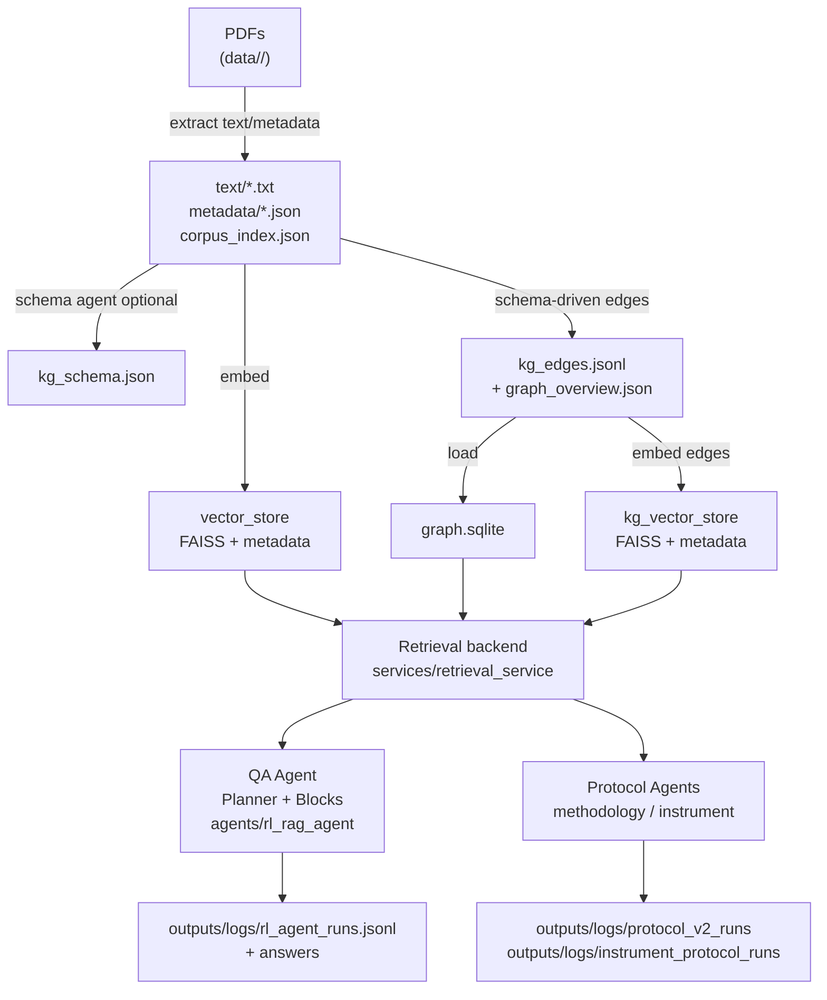
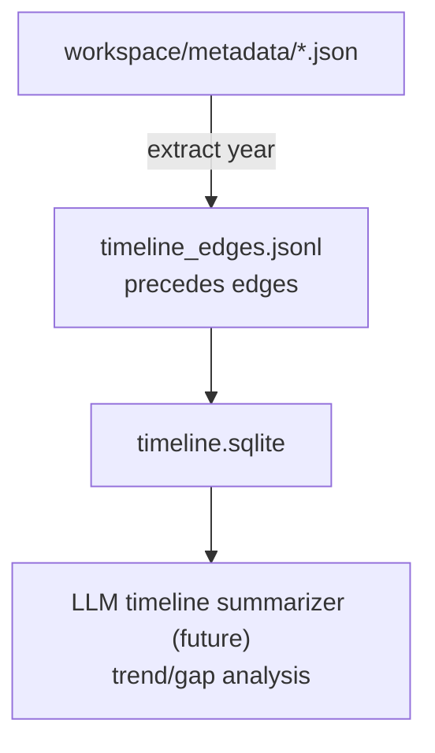

# BioAgentHub: RAG + RL + Protocols across Topics

This workspace ingests scientific PDFs, builds per-topic text/vector workspaces, and powers retrieval-augmented RL + LLM agents for QA and protocol generation. PETase is just one topic; other topics include `3hp_pand`, `c4c2_decarb`, `ired`, `retron`, `transaminase`. Biofoundry instrument-aware protocols are supported via instrument corpora. All PDFs now live under `data/<topic>/` (PETase is in `data/petase/`).

## Repository Layout

```
data/                  # topic folders (3hp_pand, c4c2_decarb, ired, petase, retron, transaminase) ← PDFs live here
workspaces/            # canonical latest workspaces (text, vector_store, KG, methodology stores, timeline artifacts)
archive/legacy_20260204/  # archived legacy assets (see below)
forge/                 # IE + KG construction stage (canonical entrypoint + scripts)
fabric/                # agentic reasoning stage (consumes forge outputs)
InstrumentGraph/       # instrument text/metadata/kg_edges/vector_store/inventory (prebuilt)
ModuleTemplate/        # biofoundry protocol templates (verbatim)
services/              # retrieval backends, LLM config, instrument/methodology helpers
agents/                # QA/protocol agents (compatibility wrappers)
app/                   # CLI + UI entrypoints (Gradio/QA/protocol)
docs/                  # architecture notes and refresh guides
```

Note: the legacy combined `all_topics` workspace is archived under `archive/legacy_20260204/` and ignored by discovery. If you rebuild `all_topics` (e.g., via `build_topic_workspaces.py`), it is still excluded from discovery unless you allow non‑canonical workspaces.

Archived (unused by default):
- `archive/legacy_20260204/KnowledgeGraph/` (legacy PETase KG)
- `archive/legacy_20260204/attic/` (legacy workspaces)
- `archive/legacy_20260204/all_topics/` (combined workspace; ignored by default)
- `archive/legacy_20260204/outputs_old_*` (prior runs)
- `archive/legacy_20260204/PETASE_gen/` (legacy protocol generation outputs)

## Environment Setup (Required Before Running)

1) Create/activate a Python environment (Python 3.9+):
```bash
python -m venv .venv
source .venv/bin/activate
```

2) Install dependencies:
```bash
pip install -r requirements.txt
```

3) Set LLM credentials (required for QA/protocol/biofoundry):
```bash
cp .env.example .env
export OPENAI_API_KEY="your_key_here"
```

`config/llm_config.json` reads `OPENAI_API_KEY` by default. If you want a different backend/model, update the config file and ensure the corresponding env vars are set before launching any CLI/UI/FastAPI process.

### Environment troubleshooting
- `AttributeError: 'MessageFactory' object has no attribute 'GetPrototype'`: install `protobuf<5` (already pinned in `requirements.txt`).
- `Pandas requires version '1.3.6' or newer of 'bottleneck'`: install `bottleneck>=1.3.6` (already pinned).
- `ResolutionImpossible` for `requests`: `pydantic-ai` requires `requests>=2.32.3`; the repo now pins `requests>=2.32.3`.
- `ModuleNotFoundError: No module named 'pypdfium2'`: install `pypdfium2` (required by `generic_extract_corpus.py` for PDF rendering/OCR).
- `tesseract` not found: OCR fallback is disabled; install the system `tesseract` binary if you need OCR.

## Forge Stage (IE + KG)

Forge encapsulates the IE + KG construction pipeline. It assumes PDFs already exist under `data/<topic>/`, extracts text + tables/captions, induces schemas via PydanticAI (validated), builds facts/KG/vector stores, and generates structured audits.

Canonical entrypoint (all topics):
```bash
python forge/run_forge.py --topics petase 3hp_pand retron
```

Key properties:
- Schema induction defaults to PydanticAI with strict validation.
- Caption/table extraction is part of structured facts.
- Structured audit reports are generated under `outputs/reports/structured_audit/`.
- Latest KG lives only in `workspaces/<topic>/`; legacy workspaces are archived under `archive/legacy_20260204/`.
- `archives/` under each workspace are older versions and not read by default.

## Fabric Stage (Agentic Reasoning)

Fabric is the agentic reasoning layer. It consumes Forge outputs from `workspaces/<topic>/` (KG, vectors, methodology KG, instrument graph) and runs QA, protocol generation, and biofoundry decision workflows. Fabric does **not** rebuild evidence or regenerate schemas.

## QA Pipeline (Planner → Retrieval → Structured Blocks)
The QA agent (`fabric/agents/rl_rag_agent.py`) now uses a **Pydantic‑validated planner** and **structured JSON blocks** while keeping the retrieval stack intact.

### Step 1 — Question Planner (Pydantic-validated)
An LLM planner outputs a strict JSON plan:
- `intent`: one of `candidate_selection`, `comparison`, `fact_lookup`, `limitations_or_gaps`, `mechanism_explanation`, `protocol_request`, `evidence_audit`, `other`
- `required_blocks`: list of block specs (`direct_answer`, `ranked_entities`, `caveats`, `evidence_audit`, `next_actions`)
- `allowed_rank_entity_types`: **type gate** for ranked entities
- `required_signals`: semantic signals to look for (e.g., “improves”, “reduces”, “mutation_effect”)
- `retrieval_queries`: **replaces fixed subqueries**
- `exclude_patterns`: boilerplate strings to penalize
- `abstain_conditions`: when to abstain

If planner output is invalid, the system falls back to a safe plan and **forces EvidenceAuditBlock**.
Planner/composer LLM calls use the configured backend in `config/llm_config.json` (OpenAI or Ollama).

### Step 2 — Retrieval (unchanged core)
Retrieval remains the same:
- Dense vector search + optional BM25
- RRF fusion
- Optional reranking (supports cross-encoder if `QA_CROSS_ENCODER_MODEL` is set)

**Only change:** use `planner.retrieval_queries` and apply `exclude_patterns` as a negative scoring factor.

### Step 3 — Structured Composer (JSON-only)
The composer returns **only JSON blocks** (no prose) and validates them with Pydantic:
- `DirectAnswerBlock` (bullets + citations)
- `RankedEntitiesBlock` (type‑gated, evidence‑grounded)
- `CaveatsBlock`
- `EvidenceAuditBlock`
- `NextActionsBlock` (optional)

**Type gate**: Only entity types listed in `planner.allowed_rank_entity_types` may be ranked.  
**Evidence grounding**: Ranked items and answer bullets must cite evidence IDs.  
**Abstention**: If `planner.abstain_conditions` match, return **EvidenceAuditBlock only**.
Understanding-layer blocks are also validated; validation failures are treated as abstentions and logged.

UI note: If a frontend cannot render blocks directly, the QA agent exposes a **text fallback renderer** that formats blocks + citations into readable Markdown.

### Demo sanity outputs (test_hmmm)
- Run `python test_hmmm/run_demos.py` to generate QA/protocol/biofoundry demo outputs.
- Outputs are **timestamped** (e.g., `qa_chat_petase_YYYYMMDD_HHMMSS.md/.json`) and also mirrored to `*_latest.*` for quick access.
- QA demo uses **readable answer mode** (no KG block) with inline citations; set `QA_INCLUDE_GAPS=1` to include evidence-gap/next-steps sections, `QA_SHOW_STATUS=1` to show Grounded/Inferred tags, and `QA_HIDE_INFERRED=0` to keep ungrounded sentences.

### Claims‑Lite (optional, behind a flag)
When enabled, the QA agent extracts **atomic claim tuples** from top evidence chunks and composes blocks from claims instead of raw chunks.
- Flag: `--use-claim-store` (default off)
- Optional persistence: `--persist-claims` writes to `workspaces/<topic>/claim_store/claims.jsonl` with a lightweight index.
- If too few claims are extracted or validation fails, the system **falls back to chunk‑based composition** or abstains per planner rules.

Claims are constrained to a bounded relation set, include evidence IDs, and enforce “no hallucinated metrics” by filtering qualifiers not present in the evidence text.

### LangGraph QA (optional)
LangGraph wraps the same QA steps in a graph (planner → retrieval → compose), adding state tracking and retries.
- Flag: `--use-langgraph-qa` (default off)
- Same answer quality as regular QA; mainly improves traceability/logging.
Keep regular QA as the default unless you want the explicit state machine for debugging.

### Answer Modes (strict / helpful / dual)
- `--output-mode answer_strict`: current behavior; EvidenceAudit-only answers are allowed.
- `--output-mode answer_helpful`: always returns a readable, structured answer with grounding tags, even when evidence is missing.
  Helpful mode uses a two-pass draft + grounding step, feeds top evidence snippets into the draft prompt, and adds a short "What I could not verify" footer.
- `--output-mode answer_dual`: returns **both** a narrative LLM answer and the KG-structured answer (or EvidenceAudit),
  so you get a human-readable summary plus a precise audit of missing signals.

Composer robustness:
- `QA_COMPOSER_RELAX=1` (default): attempts a JSON repair pass if the structured block composer returns invalid JSON.
- `QA_RELAX_VALIDATION=1`: relaxes missing-citation checks for direct-answer bullets (ranked items still require evidence). Default is strict (`QA_RELAX_VALIDATION=0`).
- `QA_BLOCK_FALLBACK=1` (default): if the composer still fails, emit a minimal DirectAnswerBlock built from top evidence.
Evidence tuning:
- `QA_DENSE_TOP_K` (default 20): number of dense hits per query before fusion.
- `QA_RERANK_TOP_K` (default 40): number of items kept after rerank or RRF.
- `QA_RRF_K` (default 60): RRF fusion depth.
- `QA_EVIDENCE_MAX_ITEMS` (default 12): max evidence snippets for the composer.
- `QA_METHOD_EVIDENCE=1` (default on): include methodology KG evidence in QA.
- `QA_METHOD_EVIDENCE_K` (default 6): number of methodology snippets to add.
- `QA_KG_EDGE_EVIDENCE=1` (default on): include KG edge evidence in QA.
- `QA_KG_EDGE_EVIDENCE_K` (default 20): number of KG edge snippets to add.
- `QA_KG_EDGE_POOL` (default `limit*10`): initial KG edge pool before signal filtering.
- `QA_KG_CANDIDATE_EVIDENCE=1` (default on): include KG candidate summary evidence.
- `QA_KG_CANDIDATE_EVIDENCE_K` (default 8): number of candidate entities to summarize.
Citation formatting:
- Sources render as `Authors — Year — Title — DOI` when metadata is available (falls back to title or filename stem).

### Session Context (multi‑turn)
Session state is persisted under `outputs/qa_outputs/<topic>/<session_id>/` (with per‑turn timestamp subfolders) and includes:
- `entity_memory`, `rolling_summary`
- `working_set_entities`, `open_slots`, `last_intent`

Planner reads these fields to bias retrieval queries. No free‑text memory is injected into answers.

### Logs & Artifacts (per turn)
Each QA turn writes under `outputs/qa_outputs/<topic>/<session_id>/<timestamp>/`:
- `turn_<n>_input.json` (input flags + intent)
- `turn_<n>_planner.json` (planner output + validation)
- `turn_<n>_queries.json` (planner queries + required blocks)
- `turn_<n>_retrieval.json`, `turn_<n>_fusion.json`, `turn_<n>_rerank.json`
- `turn_<n>_answer.json` (draft/final/structured + citations)
- `turn_<n>_blocks.json` (structured output)
- `turn_<n>_claims.json` (claims-lite stats, when enabled)
- `turn_<n>_validation.json`, `turn_<n>_abstain.json`, `turn_<n>_verifier.json`
- `turn_<n>_evidence_ids.json`
- `run_report.md`

Session‑level files (stored at `outputs/qa_outputs/<topic>/<session_id>/`):
- `session_state.json`, `index.jsonl`, `latest_pointer.json`
Additionally, a per-run summary is written to `workspaces/<topic>/qa_runs/<run_id>/` (JSON + Markdown) when the QA pipeline completes.

### QA Regression Tests
Basic guardrails live under `tests/test_qa_blocks.py`:
- candidate_selection returns `RankedEntitiesBlock` or `EvidenceAuditBlock`
- ranked items always cite evidence
- disallowed types are blocked by the type gate
- abstention triggers on missing evidence (even when blocks are present)

Run:
```bash
python -m unittest tests/test_qa_blocks.py
python -m unittest tests/test_claims_lite.py
python -m unittest tests/test_qa_graph.py
python -m unittest tests/test_answer_mode.py
python -m unittest tests/test_output_mode.py
```

### Gradio QA UI (single instance)
`app/gradio_chatbot.py` writes a PID file under `outputs/logs/` and will terminate the previous Gradio run from this repo before starting, so you don't end up with stale servers.

## UI Launchers (Meta UI)
Gradio is the **default meta UI** (QA + protocol + biofoundry template + biofoundry orchestrator + multi-agent).

### Gradio (default)
```bash
python app/gradio_chatbot.py
```
To create a share link:
```bash
python app/gradio_chatbot.py --share
```

Gradio exposes the same QA toggles (LLM, KG, query planner, BM25, rerank, verifier, claims-lite, persistence) plus tabs for biofoundry orchestration and multi-agent outputs.

## End-to-End Pipeline (Plug & Play per Topic)

### One-shot build for any topic (text + vectors + KG)
```bash
# Example: PETase
python forge/scripts/build_topic_full.py --topic petase --pdf-dir data/petase --workspace workspaces/petase --auto-schema --focus-query "protein engineering"

# Example: 3hp_pand (schema + full KG build)
python forge/scripts/build_topic_full.py --topic 3hp_pand --pdf-dir data/3hp_pand --workspace workspaces/3hp_pand --auto-schema --focus-query "protein engineering"
```
- Steps inside the script:
  1) `forge/scripts/generic_extract_corpus.py` → `workspace/text`, `workspace/metadata`, `workspace/corpus_index.json`
  2) `forge/scripts/generic_build_vector_store.py` → `workspace/vector_store` (FAISS + metadata over text)
  3) (Optional) `forge/agents/kg_schema_agent.py --workspace ...` → `workspace/kg_schema.json`
  4) `forge/scripts/build_kg_edges.py --workspace ... [--schema workspace/kg_schema.json]` → `workspace/kg_edges.jsonl`, `workspace/graph_overview.json`
  5) `forge/scripts/build_graph_store.py --edges ... --database workspace/graph.sqlite`
  6) `forge/scripts/build_vector_store.py --edges ... --out-dir workspace/kg_vector_store` (semantic search over edges)
- Use `--skip-kg` if you only want text + vectors. The KG heuristics are schema-driven; regenerate schemas per topic as needed.

### Batch rebuild (text + vectors only)
```bash
python forge/scripts/build_topic_workspaces.py --data-root data --workspace-root workspaces --model sentence-transformers/all-MiniLM-L6-v2
```
Outputs per-topic workspaces (`workspaces/3hp_pand`, `.../retron`, etc.). Run `forge/scripts/build_topic_full.py` per topic to add KG/graph on top.
Note: `build_topic_workspaces.py` also creates `petase_full` (if `Papers/` exists) and `all_topics` unless `--skip-combined` is set. `all_topics` is **excluded** by default from workspace discovery; use `ALLOW_NONCANONICAL_WORKSPACE=1` or a direct path if you explicitly want it.

### Methodology/protocol stores (optional)
Protocol agent v2 reads optional stores under each workspace:
- `workspaces/<topic>/methodology_vector_store/`
- `workspaces/<topic>/methodology_edge_store/`
- `workspaces/<topic>/protocols/` (legacy protocol corpus used by the instrument agent)

Additional methodology artifacts that may exist (not used directly by runtime code, but often prebuilt):
- `workspaces/<topic>/methodology_full/` (raw full‑section JSON per paper)
- `workspaces/<topic>/methodology_kg_schema.json`, `workspaces/<topic>/methodology_kg_edges.jsonl`, `workspaces/<topic>/methodology_kg_summary.json`

If these folders are missing, the agent still runs but may produce thinner outputs. Build them with:
```bash
python forge/scripts/build_topic_methodology.py --workspace workspaces/<topic>
```

### Biofoundry instruments
Instrument evidence is read from `InstrumentGraph/`. To enable instrument-constrained protocol generation, set `BIOAGENT_USE_INSTRUMENTS=1` (the `app/hub_cli.py biofoundry` wrapper does this by default; direct runs of `fabric/agents/biofoundry_protocol_orchestrator.py` require both `--include-instruments` and the env var).

### Architecture (conceptual)
```
PDFs (data/<topic>/)
   │
   ├─ extract text/metadata (generic_extract_corpus.py)
   │     └─ corpus_index.json + text/*.txt + metadata/*.json
   │
   ├─ text vectors (generic_build_vector_store.py) → workspace/vector_store
   │
   ├─ heuristic KG edges (build_kg_edges.py) → kg_edges.jsonl + graph_overview.json
   │     └─ graph DB (build_graph_store.py) → graph.sqlite
   │     └─ edge vectors (build_vector_store.py) → kg_vector_store
   │
   └─ Agents:
         ├─ Retrieval backend (services/retrieval_service) uses vector_store + graph.sqlite
         ├─ QA agent (agents/rl_rag_agent): planner + retrieval + structured blocks
         └─ Protocol agents (methodology/instrument) → outputs/logs/protocol_v2_runs, outputs/logs/instrument_protocol_runs
```

### Example workflows
- PETase (full build + QA, KG-first):
  ```bash
  python forge/scripts/build_topic_full.py --topic petase --pdf-dir data/petase --workspace workspaces/petase --auto-schema --focus-query "protein engineering"
  WORKSPACE_ROOT=workspaces/petase USE_ALIAS_EXPANSION=1 python fabric/agents/rl_rag_agent.py ask "What mutations improve PETase thermostability?"
  ```
- 3hp_pand (full build, KG-first):
  ```bash
  python forge/scripts/build_topic_full.py --topic 3hp_pand --pdf-dir data/3hp_pand --workspace workspaces/3hp_pand --auto-schema --focus-query "protein engineering"
  WORKSPACE_ROOT=workspaces/3hp_pand USE_ALIAS_EXPANSION=0 python fabric/agents/rl_rag_agent.py ask "What are the key enzymes in the 3hp_pand pathway?"
  ```

### Diagrams (Mermaid)

Architecture:

See `docs/kg_agentic_architecture.md` for the agentic KG design and communication model.

Timeline inputs (optional):

If `timeline_edges.jsonl` is missing, the gap agent will still run but report the timeline edges as absent.
Build timeline artifacts with:
```bash
python forge/scripts/build_timeline_graph.py --workspace workspaces/<topic>
```
The included `timeline_summarizer.py` only summarizes metadata years (no edges/db build).

Timeline summarizer (CLI):
```bash
python agents/timeline_summarizer.py --workspace workspaces/petase
```

RL action masking / vector-only mode:
- Set `VECTOR_ONLY_RAG=1` to force the QA agent to skip graph expansions when a workspace lacks a KG or you want pure vector RAG.

### Regenerating artifacts (not tracked in git)
- Rebuild a topic (text + vectors + KG):
  ```bash
  python forge/scripts/build_topic_full.py --topic <name> --pdf-dir data/<name> --workspace workspaces/<name>
  ```
- Bulk text+vector rebuild (no KG):
  ```bash
  python forge/scripts/build_topic_workspaces.py --data-root data --workspace-root workspaces --model sentence-transformers/all-MiniLM-L6-v2
  ```
Generated artifacts (`data/*.pdf`, `workspaces/`, `InstrumentGraph/`, `outputs/`, `archive/legacy_*/`, `*.faiss`, `*.npy`) are gitignored; rerun the commands above to recreate locally.

### Structured extraction (captions/tables/facts)
- Run `python forge/scripts/run_structured_audit.py` to extract captions/tables, build normalized facts, and emit audit reports. See `docs/structured_extraction.md`.

### Multi-agent orchestrator (KG + timeline + protocol)
```bash
python agents/multi_agent_orchestrator.py --workspace workspaces/petase --query "Design PETase benchmarking workflow"
```
- Executes QA (KG + text) with LLM, timeline/KG gap summary, hypothesis generation, computational + experimental plans (merged), and a methodology protocol draft. KG is required unless you explicitly set `VECTOR_ONLY_RAG=1` (not recommended).

## Usage Guide

### QA (CLI)
```bash
# One-shot QA (Typer CLI)
WORKSPACE_ROOT=workspaces/petase python fabric/agents/rl_rag_agent.py ask "What mutations improve PETase thermostability?"
```
Use `--output-mode answer_dual` (recommended), `--use-claim-store` as needed, and `--use-langgraph-qa` only if you want graph-style logging.
To persist session memory across turns, add `--chat` and reuse `--session-id`.

### QA chat (interactive, CLI)
```bash
python app/hub_cli.py qa-chat --workspace workspaces/petase --output-mode answer_dual
```

### QA chat (LangGraph CLI)
```bash
python app/qa_chat_langgraph.py --workspace workspaces/petase --alias-expansion --show-citations --show-metrics
```
Use this if you want LangGraph state tracking in a terminal loop.

### Gradio UI (default)
```bash
python app/gradio_chatbot.py --host 127.0.0.1 --port 7860
```
To create a share link:
```bash
python app/gradio_chatbot.py --share
```

### Protocol agents (direct)
- Methodology-driven (v2): `WORKSPACE_ROOT=workspaces/petase python app/protocol_agent_cli_v2.py "..."` (uses methodology stores if present)
- Instrument-constrained (v2): `WORKSPACE_ROOT=workspaces/petase python app/instrument_protocol_cli_v2.py "..."` (reads InstrumentGraph; sets `BIOAGENT_USE_INSTRUMENTS=1` by default)
- Biofoundry templates: `python agents/biofoundry_protocol_agent.py <case>` (`petase`, `3hp_pand`, `retron`)

### Unified CLI (QA + protocol + biofoundry + multi-agent)
```bash
python app/hub_cli.py qa "What mutations improve PETase thermostability?" --workspace workspaces/petase --output-mode answer_dual
python app/hub_cli.py protocol "Design PETase benchmarking workflow" --workspace workspaces/petase
python app/hub_cli.py biofoundry --topics petase,3hp_pand --llm-rationale
python app/hub_cli.py multi-agent --workspace workspaces/petase --query "Design PETase benchmarking workflow"
python app/hub_cli.py kg-build --topic petase --auto-schema --focus-query "protein engineering"
```

### FastAPI retrieval (optional)
```bash
uvicorn services.retrieval_service:app --host 0.0.0.0 --port 8000 --reload
```
- Honors `WORKSPACE_ROOT` for swapping vector/graph; `USE_ALIAS_EXPANSION=0` to disable PETase-specific query boosts.
- Uses the FAISS vector index (MiniLM) and optional PETase KG neighbors when present.

### FastAPI hub (QA + protocol + biofoundry + multi-agent)
```bash
uvicorn app.hub_api:app --host 0.0.0.0 --port 8010 --reload
```
Endpoints:
- `GET /health`
- `POST /qa`
- `POST /protocol_v2`
- `POST /biofoundry/generate`
- `POST /multi_agent/run`
- `POST /kg/build`

## Reproducibility Reference (Inputs / Outputs / Parameters)

This section is a complete reference for the data structures, parameters, and artifacts used by each component.

### A) Forge: KG construction (PDF -> text, vectors, KG, graph)
Capabilities:
- Extract PDF text + metadata.
- Build text vector stores (FAISS + metadata).
- Induce KG schema (LLM, optional).
- Extract KG edges + build graph + KG vector store.
- Run structured audit (captions/tables/facts + reports).

Primary entrypoints:
- `python forge/run_forge.py --topics petase 3hp_pand retron`
- `python forge/scripts/build_topic_full.py --topic petase --pdf-dir data/petase --workspace workspaces/petase --auto-schema`

Inputs:
- `data/<topic>/*.pdf` (source papers).
- `config/llm_config.json` (schema induction backend/model/seed).
- Optional: `WORKSPACE_ROOT` for scripts that use workspace resolution.

Outputs (per topic workspace):
- `workspaces/<topic>/text/*.txt`
- `workspaces/<topic>/metadata/*.json`
- `workspaces/<topic>/corpus_index.json`
- `workspaces/<topic>/vector_store/` (text embeddings)
- `workspaces/<topic>/kg_schema.json` (optional)
- `workspaces/<topic>/kg_edges.jsonl` + `workspaces/<topic>/graph_overview.json`
- `workspaces/<topic>/graph.sqlite`
- `workspaces/<topic>/kg_vector_store/`
- `workspaces/<topic>/facts/facts.jsonl` (when structured audit/facts enabled)
- `outputs/reports/structured_audit/<topic>_report.json` + `.md`

Key CLI parameters:
- `forge/run_forge.py`: `--topics`, `--workspace-root`, `--pdf-root`, `--report-dir`, `--model`, `--kg-model`, `--focus-query`, `--max-pdfs/--limit-pdfs`, `--max-pages`, `--no-ocr`, `--verify-only`, `--skip-existing/--no-skip-existing`, `--force-rebuild`, `--delete-old`.
- `forge/run_forge.py`: `--embedding-backend`, `--kg-embedding-backend` (defaults to `sentence-transformers`).
- `forge/scripts/build_topic_full.py`: `--topic`, `--pdf-dir`, `--workspace`, `--model`, `--embedding-backend`, `--kg-model`, `--kg-embedding-backend`, `--skip-kg`, `--with-artifacts`, `--with-facts`, `--kg-schema`, `--auto-schema`, `--focus-query`.

Additional Forge utilities (direct use):
- `forge/agents/kg_schema_agent.py`: `--workspace`, `--focus-query`, `--output`, `--sample-docs`, `--sample-chars`, `--no-llm`, `--seed`, `--backend`.
- `forge/scripts/generic_run_pipeline.py`: `--pdf-dir`, `--workspace`, `--model`.
- `forge/scripts/generic_extract_corpus.py`: `--pdf-dir`, `--workspace`, `--export-images` (renders PNGs).
- `forge/scripts/generic_build_vector_store.py`: `--workspace`, `--model`, `--embedding-backend`, `--batch-size`, `--no-faiss`.
- `forge/scripts/build_kg_edges.py`: `--workspace` (preferred), or `--text-dir`, `--corpus-index`, `--out-edges`, `--out-summary`, plus `--schema` and `--focus-keywords` for tuning.
- `forge/scripts/build_graph_store.py`: `--edges`, `--database`.
- `forge/scripts/build_vector_store.py`: `--edges`, `--out-dir`, `--model`, `--embedding-backend`, `--batch-size`, `--no-faiss`.
- `forge/scripts/extract_pdf_artifacts.py`: `--workspace`, `--pdf-dir`, `--out-dir`, `--max-pdfs`, `--max-pages`, `--no-ocr`.
- `forge/scripts/build_structured_facts.py`: `--workspace`, `--artifacts-dir`, `--out-path`.
- `forge/scripts/run_structured_audit.py`: `--topics`, `--workspace-root`, `--pdf-root`, `--report-dir`, `--max-pdfs/--limit-pdfs`, `--max-pages`, `--no-ocr`, `--artifacts-root`, `--facts-root`.
- `forge/scripts/build_topic_workspaces.py`: `--data-root`, `--workspace-root`, `--model`, `--petase-main`, `--skip-combined`, `--export-images`.
- `forge/scripts/rebuild_vector_store_embeddings.py`: `--workspace`, `--backend`, `--model`, `--batch-size`, `--no-faiss`.
- `forge/scripts/build_topic_methodology.py`: `--workspace`, `--model`, `--embedding-backend`, `--no-faiss`.
- `forge/scripts/extract_methodology_full.py`: `--workspace` or `--text-dir`, `--output-dir`, `--corpus-index`.
- `forge/scripts/build_methodology_kg.py`: `--workspace` or `--method-dir`, `--out-edges`, `--summary`.
- `forge/scripts/build_methodology_edge_store.py`: `--edges`, `--out-dir`, `--model`, `--embedding-backend`, `--batch-size`, `--no-faiss`.
- `forge/scripts/build_methodology_vector_store.py`: `--method-dir`, `--out-dir`, `--model`, `--embedding-backend`, `--batch-size`, `--min-chars`, `--no-faiss`.
- `forge/scripts/build_timeline_graph.py`: `--workspace`.

Forge parameter definitions (expanded):
- `--topics`: topic folder names under `data/` to process (defaults to `petase`, `3hp_pand`, `retron` in `run_forge.py`).
- `--workspace-root`: root directory where per-topic workspaces are created.
- `--workspace`: specific workspace path for single-topic scripts.
- `--pdf-root`: root directory containing `data/<topic>` PDF folders.
- `--pdf-dir`: directory containing PDFs for a single topic/build.
- `--report-dir`: output directory for structured audit reports.
- `--model`: embedding model for text vector stores (or generic embedding model for simple pipelines).
- `--embedding-backend`: embedding backend (`sentence-transformers` or `openai`).
- `--kg-model`: embedding model for KG edge vector store.
- `--kg-embedding-backend`: embedding backend for KG edge vectors.
- `--focus-query`: short prompt used to bias schema induction and relation extraction.
- `--max-pdfs/--limit-pdfs`: process only the first N PDFs (audit/artifacts stages).
- `--max-pages`: process only the first N pages per PDF (audit/artifacts stages).
- `--no-ocr`: disable OCR fallback (tesseract) during extraction.
- `--verify-only`: check artifact presence and exit without rebuilding.
- `--skip-existing/--no-skip-existing`: skip rebuilds when outputs exist (default on), or force rebuild passes.
- `--force-rebuild`: rebuild even when outputs exist or schema config mismatches.
- `--delete-old`: delete existing outputs instead of archiving under `workspace/archives/`.
- `--batch-size`: embedding batch size for vector store builds/rebuilds.
- `--no-faiss`: skip FAISS index construction (embeddings + metadata still written).
- `--export-images`: render page PNGs alongside extracted text (debug/QA).
- `--skip-kg`: build text + vectors only (no KG edges/graph/vector store).
- `--with-artifacts`: extract captions/tables (`extract_pdf_artifacts.py`).
- `--with-facts`: build normalized facts from text/captions/tables (`build_structured_facts.py`).
- `--kg-schema`: explicit schema JSON path for KG extraction.
- `--auto-schema`: run `kg_schema_agent.py` before KG extraction to generate `kg_schema.json`.
- `--schema`: schema JSON path for `build_kg_edges.py` (defaults to `<workspace>/kg_schema.json` if present).
- `--focus-keywords`: boost KG edge confidence when sentence contains these terms.
- `--out-dir`: output directory for vector stores or extracted artifacts.
- `--out-edges` / `--out-summary`: output paths for `kg_edges.jsonl` and `graph_overview.json`.
- `--database`: output SQLite path for `graph.sqlite`.
- `--artifacts-dir`: directory containing extracted captions/tables (input to facts build).
- `--out-path`: output JSONL path for facts.
- `--artifacts-root` / `--facts-root`: override default artifact/facts roots in `run_structured_audit.py`.
- `--petase-main`: extra PDF folder merged with `data/petase` to build `petase_full`.
- `--skip-combined`: disable building the `all_topics` combined workspace.
- `--backend`: embedding backend override in `rebuild_vector_store_embeddings.py`.
- `--sample-docs`: number of docs sampled for schema induction.
- `--sample-chars`: max characters sampled across docs for schema induction.
- `--no-llm`: skip LLM schema induction and emit default schema.
- `--seed`: random seed for deterministic sampling/QA.
- `--output`: explicit output file path (schema, protocol markdown, etc., depending on script).
- `--min-chars`: minimum methodology section length to index (methodology vector store build).

Embedding backend options:
- Default: `sentence-transformers/all-MiniLM-L6-v2` with `--embedding-backend sentence-transformers`.
- OpenAI embeddings: `--embedding-backend openai --model text-embedding-3-large` (requires `OPENAI_API_KEY`).

`focus-query`:
- A short research prompt used by the schema induction agent to bias the KG schema (entities, relations, metrics).
- Stored in the generated `kg_schema.json` and used to steer relation extraction (what relations/fields the extractor looks for).
- Does **not** change QA retrieval directly; it shapes what gets extracted into the KG.

Data structures (canonical):
- `corpus_index.json`: list of objects with fields like `pdf_file` (**absolute path**), `txt_file`, `page_count`, `char_count`, `title_candidate`, `extraction_methods`, `images_exported`.
- `vector_store/metadata.jsonl`: each line is `{ "text": <chunk>, "metadata": { "chunk_id", "pdf_file" (absolute), "title", "source", "sources" } }`.
- `vector_store/config.json`: `{ "model", "embedding_backend", "document_count", "dimension", "embedding_file", "metadata_file", "faiss_index_file" }`.
- `kg_edges.jsonl`: each line is `{ "source", "relation", "target", "paper", "sentence", "confidence" }` where `paper` is usually the absolute PDF path from `corpus_index.json`.
- `graph.sqlite`: `nodes(id, label, type)` and `edges(id, source_id, relation, target_id, paper, sentence)`.
- `kg_vector_store/metadata.jsonl`: each line is `{ "id", "text", "metadata": { "source", "relation", "target", "paper" } }`.
- `kg_vector_store/config.json`: `{ "model", "embedding_backend", "document_count", "dimension", "embedding_file", "metadata_file", "faiss_index_file" }`.
- `facts/facts.jsonl`: each line includes `head {raw,norm}`, `relation_type`, `tail {raw,norm}`, `raw_value`, `normalized_value`, `normalized_unit`, `evidence_text`, `provenance {source,pdf,page,bbox,topic}`, `confidence`.

### B) QA agent (fabric/agents/rl_rag_agent.py)
Capabilities:
- Planner -> retrieval -> structured block composition.
- Optional BM25, rerank, verifier, claims-lite.
- Strict, helpful, and dual output modes.
- Session memory persisted to disk.

Inputs:
- `WORKSPACE_ROOT` (defaults to `workspaces/<topic>`).
- `vector_store/` (required).
- `graph.sqlite` + `kg_edges.jsonl` (optional; enable KG expansion).
- Optional: `USE_ALIAS_EXPANSION=1` (PETase aliases), `ALLOW_NONCANONICAL_WORKSPACE=1`.

Outputs:
- CLI returns JSON with `answer`, `answer_helpful`, `answer_structured`, `citations`, `metrics`, `blocks`, `claims`, `trajectory`, `use_llm`.
- Per-turn artifacts under `outputs/qa_outputs/<topic>/<session_id>/<timestamp>/`.
- QA trajectories under `outputs/logs/rl_agent_runs.jsonl`.

Key CLI parameters (`python fabric/agents/rl_rag_agent.py ask "..."`):
- `--use-llm/--no-llm`, `--temperature`
- `--use-kg/--no-kg`, `--query-planner/--no-query-planner`, `--bm25/--no-bm25`
- `--rerank/--no-rerank`, `--verifier/--no-verifier`
- `--use-claim-store/--no-claim-store`, `--persist-claims/--no-persist-claims`
- `--output-mode answer_strict|answer_helpful|answer_dual|protocol`
- `--chat/--no-chat`, `--session-id`
- `--rl-policy/--no-rl-policy`, `--policy-path`, `--seed`

QA output schema (high level):
- `citations`: list of `{ id, paper, title, source_id, source_ids, authors, year, doi }` (fields may be null).
- `blocks`: JSON objects of types `direct_answer`, `ranked_entities`, `caveats`, `evidence_audit`, `next_actions` with evidence IDs.
- `metrics`: deterministic QA uses `steps`, `unique_citations`, `coverage_proxy`, `unsupported_sentence_rate`.

Additional QA CLIs:
- `app/qa_chat_langgraph.py`: `--workspace`, `--allow-noncanonical`, `--alias-expansion`, `--session-id`,
  `--no-llm`, `--temperature`, `--no-kg`, `--no-query-planner`, `--no-bm25`, `--no-rerank`, `--no-verifier`,
  `--use-claim-store`, `--persist-claims`, `--show-citations`, `--show-metrics`.
- `fabric/agents/run_agent_plain.py`: `ask <question>`, `--seed` (text-only mode).
- `fabric/agents/run_agent_llm.py`: `ask <question>`, `--seed` (LLM mode).

QA flag definitions (core):
- `--workspace`: workspace root path (overrides discovery).
- `--allow-noncanonical`: allow workspaces outside `workspaces/`.
- `--alias-expansion`: enable topic-specific alias expansion (PETase).
- `--use-llm/--no-llm`: enable/disable LLM summarizer + composer.
- `--temperature`: LLM sampling temperature.
- `--use-kg/--no-kg`: enable/disable KG expansion during retrieval.
- `--query-planner/--no-query-planner`: enable/disable planner-driven retrieval queries.
- `--bm25/--no-bm25`: enable/disable keyword retrieval + RRF fusion.
- `--rerank/--no-rerank`: enable/disable deterministic reranking (optional cross-encoder).
- `--verifier/--no-verifier`: enable/disable citation verifier filter.
- `--use-claim-store/--no-claim-store`: enable claims-lite extraction/composition.
- `--persist-claims/--no-persist-claims`: persist claims to `workspaces/<topic>/claim_store/`.
- `--use-langgraph-qa`: use LangGraph orchestration instead of direct pipeline.
- `--output-mode`: `answer_strict`, `answer_helpful`, `answer_dual`, or `protocol`.
- `--chat/--no-chat` or `--chat-mode`: enable multi-turn memory.
- `--session-id`: fixed session id for multi-turn continuity.
- `--use-rl-policy`: run RL policy loop instead of deterministic QA.
- `--policy-path`: pickled RL policy path (only loaded by `fabric/agents/rl_rag_agent.py` CLI).
- `--seed`: random seed for deterministic components.

### C) Protocol agent v2 (methodology-driven)
Capabilities:
- Retrieves methodology sections + parameter edges.
- Optionally augments with instrument evidence.
- Generates a 2-section protocol (Experimental/Computational) via LLM.

Inputs:
- `WORKSPACE_ROOT` pointing to a topic workspace.
- `methodology_vector_store/` and `methodology_edge_store/` (per topic).
- Optional instrument evidence when `BIOAGENT_USE_INSTRUMENTS=1`.
- LLM backend configured via `config/llm_config.json`.
Note: build methodology stores with `forge/scripts/build_topic_methodology.py` if they are missing.

Outputs:
- Markdown protocol string.
- Logs in `outputs/logs/protocol_v2_runs/run_XXXXX.json` with fields:
  `question`, `experimental_sections`, `computational_sections`, `results_sections`,
  `parameter_edges`, `instrument_evidence`, `answer`.

Methodology store data structures:
- `methodology_vector_store/metadata.jsonl`: lines like `{ "id", "section_type", "heading", "paper", "pdf_file", "text" }`.
- `methodology_edge_store/metadata.jsonl`: lines like
  `{ "text", "metadata": { "paper", "pdf_file", "section_type", "heading", "relation", "value",
  "sentence", "confidence", "provenance", "normalized_value", "normalized_unit" } }`.

CLI:
- `WORKSPACE_ROOT=workspaces/<topic> python app/protocol_agent_cli_v2.py "..." [--output ...]`
Flag definitions:
- `--output`: optional file path to save the Markdown protocol.

### D) Instrument protocol agent v2 (instrument-constrained)
Capabilities:
- Uses InstrumentGraph evidence and protocol snippet retrieval (if present).
- Generates experimental/computational workflows via LLM.

Inputs:
- `InstrumentGraph/` (vector store + KG edges).
- Optional `workspaces/<topic>/protocols/` (legacy protocol snippets).
- LLM backend via `config/llm_config.json`.

Outputs:
- Markdown protocol string.
- Logs in `outputs/logs/instrument_protocol_runs/protocol_run_XXXXX.json` with
  `question`, `snippets`, `evidence`, `answer`.

InstrumentGraph data structures:
- `InstrumentGraph/kg_edges.jsonl`: lines like `{ "instrument", "relation", "value", "sentence", "pdf_file" }`.
- `InstrumentGraph/vector_store/metadata.jsonl`: lines like
  `{ "text", "metadata": { "instrument", "relation", "value", "sentence", "pdf_file" } }`.
- `InstrumentGraph/inventory.json`: list of
  `{ "name", "category", "capabilities", "use_cases", "manual_count", "manuals": [ { "file", "relative_path", "size_bytes" } ] }`.

CLI:
- `python app/instrument_protocol_cli_v2.py "..." [--workspace ...] [--output ...]`
- Toggle instruments: `--enable-instruments` / `--disable-instruments`.
Flag definitions:
- `--workspace`: optional workspace root for protocol snippets (`workspaces/<topic>/protocols`).
- `--output`: optional file path to save the Markdown protocol.
- `--enable-instruments/--disable-instruments`: toggle InstrumentGraph usage (default on).

### E) Biofoundry template selection + reasoning
Two entrypoints:
- **Template-only** (verbatim): `python agents/biofoundry_protocol_agent.py <case>`
  - Uses `ModuleTemplate/*.md` and writes a template protocol with a fixed rationale string.
- **Template + KG reasoning**: `python fabric/agents/biofoundry_protocol_orchestrator.py ...`
  - Reads `ModuleTemplate/Modules_library.md` + templates.
  - Optional KG enrichment from methodology stores and InstrumentGraph.
  - Optional LLM rationale with `--llm-rationale`.

Orchestrator outputs:
- `outputs/biofoundry_output/runs/<timestamp>/case_studies/<slug>.md` (protocol)
- `outputs/biofoundry_output/runs/<timestamp>/case_studies/<slug>_plan.json` (machine plan)
- `outputs/biofoundry_output/latest/<slug>.md` and `<slug>_plan.json` (latest pointers)
- `outputs/logs/biofoundry/auto/modules.generated.json`, `template_mapping.generated.md`

Plan JSON schema (high level):
- `case_study_title`, `organism`, `readout`, `closest_template_used`
- `ordered_modules`, `parameters_needed`, `TODOs`, `assumptions`
- `selection_evidence`, `evidence`, `assay_evidence`, `module_decisions`
- `citations`, `decision_evidence`, optional `llm_rationale`

Key orchestrator parameters:
- `--no-kg`: disable KG evidence enrichment (defaults to enabled).
- `--include-instruments`: include InstrumentGraph evidence (requires `BIOAGENT_USE_INSTRUMENTS=1`).
- `--kg-top-k`: number of methodology KG edges per module (default 5).
- `--no-assay-evidence`: disable assay-specific evidence extraction.
- `--topics <comma list>`: restrict run to specific topics (otherwise auto-discover).
- `--llm-rationale`: add LLM-generated, KG-grounded rationale section.
- `--kg-eval`: run deterministic KG health evaluation.
- `--kg-eval-out`: output directory for KG eval reports (default `outputs/logs/biofoundry/auto/kg_eval`).

### F) Retrieval FastAPI service (optional)
Entry point:
- `uvicorn services.retrieval_service:app --host 0.0.0.0 --port 8000 --reload`

Swagger UI:
- `http://127.0.0.1:8000/docs` (Swagger UI)
- `http://127.0.0.1:8000/redoc` (ReDoc)
- `http://127.0.0.1:8000/openapi.json` (OpenAPI schema)

Endpoints:
- `POST /vector_search` with `{ "query": str, "top_k": int }`
- `POST /graph_neighbors` with `{ "node": str, "top_k": int }`
- `POST /hybrid_query` with `{ "query": str, "node": str|null, "top_k": int }`

Response schema:
- `/vector_search`: `{ "results": [ { "score": float, "text": str, "metadata": {...} } ] }`
- `/graph_neighbors`: `{ "results": [ { "source", "relation", "target", "paper", "sentence" } ] }`
- `/hybrid_query`: `{ "vector": [...], "graph": [...] }`

### G) Hub FastAPI service (QA + protocol + biofoundry + multi-agent)
Entry point:
- `uvicorn app.hub_api:app --host 0.0.0.0 --port 8010 --reload`

Swagger UI:
- `http://127.0.0.1:8010/docs` (Swagger UI)
- `http://127.0.0.1:8010/redoc` (ReDoc)
- `http://127.0.0.1:8010/openapi.json` (OpenAPI schema)

Endpoints:
- `GET /health`
- `POST /qa` (see `QARequest` in `app/hub_api.py`; note: `policy_path` is accepted in the schema but not loaded by the API—use `fabric/agents/rl_rag_agent.py --policy-path` if you need a custom RL policy)
- `POST /protocol_v2` with `{ "question": str, "workspace": str|null, "allow_noncanonical": bool, "alias_expansion": bool }`
- `POST /biofoundry/generate` with `{ "topics": [str]|null, "use_kg": bool, "include_instruments": bool, "kg_top_k": int, "assay_evidence": bool, "llm_rationale": bool }`
- `POST /multi_agent/run` with `{ "query": str, "workspace": str, "alias_expansion": bool }`
- `POST /kg/build` with a build payload (see below)

Response schema (high-level):
- `/qa`: full QA JSON (answer, citations, metrics, blocks, claims).
- `/protocol_v2`: `{ "answer": "<markdown>" }`
- `/biofoundry/generate`: `{ "topics", "cases", "outputs", "output_root", "log_dir" }`
- `/multi_agent/run`: merged multi-agent JSON (qa + gaps + hypotheses + plans + protocol).
- `/kg/build`: `{ "status", "workspace", "pdf_dir", "stdout", "stderr" }`

`/kg/build` request body (builds a topic from PDFs, optionally reusing defaults):
```json
{
  "topic": "petase",
  "pdf_dir": "data/petase",
  "workspace": "workspaces/petase",
  "auto_schema": true,
  "skip_kg": false,
  "with_artifacts": false,
  "with_facts": false,
  "model": "sentence-transformers/all-MiniLM-L6-v2",
  "embedding_backend": "sentence-transformers",
  "kg_model": "sentence-transformers/all-MiniLM-L6-v2",
  "kg_embedding_backend": "sentence-transformers",
  "focus_query": "protein engineering"
}
```

### H) Unified CLI reference (`app/hub_cli.py`)
Subcommands and flags:
- `qa <question>`: `--workspace`, `--allow-noncanonical`, `--alias-expansion`, `--no-llm`, `--temperature`, `--no-kg`,
  `--no-query-planner`, `--no-bm25`, `--no-rerank`, `--no-verifier`, `--use-claim-store`, `--persist-claims`,
  `--use-langgraph-qa`, `--output-mode`, `--chat-mode`, `--session-id`, `--use-rl-policy`, `--seed`.
- `qa-chat`: `--workspace`, `--allow-noncanonical`, `--alias-expansion`, `--no-llm`, `--temperature`, `--no-kg`,
  `--no-query-planner`, `--no-bm25`, `--no-rerank`, `--no-verifier`, `--use-claim-store`, `--persist-claims`,
  `--use-langgraph-qa`, `--output-mode`, `--session-id`, `--seed`.
- `protocol <question>`: `--workspace`, `--allow-noncanonical`, `--alias-expansion`.
- `biofoundry`: `--topics`, `--no-kg`, `--include-instruments`, `--kg-top-k`, `--no-assay-evidence`, `--llm-rationale`.
- `multi-agent`: `--workspace` (required), `--query` (required), `--alias-expansion`, `--allow-noncanonical`.
- `kg-build`: `--topic`, `--pdf-dir`, `--workspace`, `--auto-schema/--no-auto-schema`, `--skip-kg`,
  `--with-artifacts`, `--with-facts`, `--model`, `--embedding-backend`, `--kg-model`, `--kg-embedding-backend`, `--focus-query`.

RL note: `--use-rl-policy` is experimental and not used in current workflows.

### Smoke Tests (terminal)
Assumes `OPENAI_API_KEY` is set.
```bash
# QA
python app/hub_cli.py qa "What mutations improve PETase thermostability?" --workspace workspaces/petase --output-mode answer_dual

# Protocol v2
python app/hub_cli.py protocol "Design PETase benchmarking workflow" --workspace workspaces/petase

# Biofoundry orchestration (module-based)
python app/hub_cli.py biofoundry --topics petase --llm-rationale

# Multi-agent orchestrator
python app/hub_cli.py multi-agent --workspace workspaces/petase --query "Design PETase benchmarking workflow"

# KG build (from PDFs)
python app/hub_cli.py kg-build --topic petase --auto-schema --focus-query "protein engineering"
```

FastAPI quick checks (after launching `uvicorn app.hub_api:app ...`):
```bash
curl -s http://127.0.0.1:8010/health | jq

curl -s http://127.0.0.1:8010/qa \
  -H "Content-Type: application/json" \
  -d '{"question":"What mutations improve PETase thermostability?","workspace":"workspaces/petase"}' | jq

curl -s http://127.0.0.1:8010/protocol_v2 \
  -H "Content-Type: application/json" \
  -d '{"question":"Design PETase benchmarking workflow","workspace":"workspaces/petase"}' | jq

curl -s http://127.0.0.1:8010/biofoundry/generate \
  -H "Content-Type: application/json" \
  -d '{"topics":["petase"],"use_kg":true,"include_instruments":false,"kg_top_k":5,"assay_evidence":true,"llm_rationale":true}' | jq

curl -s http://127.0.0.1:8010/multi_agent/run \
  -H "Content-Type: application/json" \
  -d '{"query":"Design PETase benchmarking workflow","workspace":"workspaces/petase","alias_expansion":true}' | jq
```

### Global configuration and env vars
- `config/llm_config.json`: `backend` (`openai` or `ollama`), `model`, `api_base`, `api_key_env`, `temperature`,
  `schema_induction_backend`, `schema_induction_model`, `schema_induction_seed`.
- `OPENAI_API_KEY` (if backend is OpenAI).
- `OPENAI_EMBED_BASE_URL` (optional override for OpenAI embeddings endpoint).
- `OLLAMA_HOST`, `OLLAMA_MODEL` (if backend is Ollama).
- `EMBEDDING_BACKEND` (default for build scripts: `sentence-transformers` or `openai`).
- `WORKSPACE_ROOT`: overrides default workspace resolution.
- `ALLOW_NONCANONICAL_WORKSPACE=1`: allow workspaces outside `workspaces/`.
- `USE_ALIAS_EXPANSION=1`: PETase alias expansion in retrieval.
- `BIOAGENT_USE_INSTRUMENTS=1`: enable InstrumentGraph usage.
- `VECTOR_ONLY_RAG=1`: QA agent skips KG expansion.
- `BIOAGENT_OUTPUT_ROOT`: override output root (default: `outputs/`).

## Metrics Explained

Metrics vary by mode:
- QA (deterministic): `steps`, `unique_citations`, `coverage_proxy`, `unsupported_sentence_rate`.
- RL loop (heuristic/PPO): `faiss_avg`, `kg_conf_avg`, `rl_reward_sum`.

Citations are emitted as inline `[n]` markers referencing the originating PDF.

## Inputs & Outputs

- **Input**: PDFs under `data/<topic>/` (all topics, including PETase). Add new files and run `forge/scripts/build_topic_full.py` (or `forge/scripts/generic_run_pipeline.py` if you want text+vectors only).
- **Output (per workspace)**:
  - Text files (`workspace/text/*.txt`)
  - Metadata JSON (`workspace/metadata/*.json`)
  - Corpus index (`workspace/corpus_index.json`)
  - Vector store over text (`workspace/vector_store/*`)
  - KG schema (`workspace/kg_schema.json`, optional)
  - Knowledge graph edges (`workspace/kg_edges.jsonl`) + summary (`workspace/graph_overview.json`)
  - Graph DB (`workspace/graph.sqlite`)
  - Edge vector store (`workspace/kg_vector_store/*`)
  - Methodology stores (optional, buildable): `methodology_vector_store/`, `methodology_edge_store/`, `methodology_full/`, `methodology_kg_*`
  - Timeline artifacts (optional, buildable): `timeline_edges.jsonl`, `timeline.sqlite`, `timeline_overview.json`
- **Logs**: QA run bundles (`outputs/qa_outputs/<topic>/<session_id>/<timestamp>/turn_*` + `session_state.json`), QA/agent runs (`outputs/logs/*.jsonl`), protocol runs (`outputs/logs/protocol_v2_runs/*.json`, `outputs/logs/instrument_protocol_runs/*.json`).

Default output root is `outputs/` (override with `BIOAGENT_OUTPUT_ROOT`).

## How the RL/LLM agent works

The default QA path is deterministic (vector search → optional KG expansion → structured composer).

An optional RL policy loop exists behind `--rl-policy` and `--policy-path <pickle>`, but it is **not used in current workflows** and no training scripts or pretrained policies are included in this repo.

RL runs log FAISS/KG scores and reward totals to `outputs/logs/rl_agent_runs.jsonl`.

## Current Setup Snapshot

- **Workspaces**: per-topic under `workspaces/<topic>`. Use `forge/scripts/build_topic_full.py` per topic to add KG/graph alongside text vectors; `forge/scripts/build_topic_workspaces.py` still does bulk text+vector builds (creates `all_topics` unless `--skip-combined`, but `all_topics` is excluded by default from discovery).
- **Retrieval embedder**: FAISS indexes built with `sentence-transformers/all-MiniLM-L6-v2`. You can change via `--model` in the build scripts.
- **KG coverage**: Legacy PETase KG archived under `archive/legacy_20260204/KnowledgeGraph/`. Current per-topic KGs live in `workspaces/<topic>` and schemas in `workspaces/<topic>/kg_schema.json`. Heuristics are schema-driven; tune `forge/scripts/build_kg_edges.py` or regenerate schemas for new topics.
- **LLM**: OpenAI `gpt-4o-mini` by default (`config/llm_config.json`, reads `OPENAI_API_KEY`). Ollama profile remains in `config/llm_profiles.json`.
- **Protocol generation**: Methodology-driven and instrument-constrained agents pull from the same workspaces/instrument corpora; runs are logged under `outputs/logs/protocol_v2_runs/` and `outputs/logs/instrument_protocol_runs/`. Biofoundry templates can be emitted verbatim from `ModuleTemplate/` via `python agents/biofoundry_protocol_agent.py <case>` (`petase`→E.coli plate reader, `3hp_pand`→E.coli Echo-MS, `retron`→E.coli plate reader build-only; add genotyping TODOs separately).
- **Gradio**: set `WORKSPACE_ROOT` + `GRADIO_SERVER_NAME/PORT` to launch; QA tab uses RAG+RL+LLM, Protocol tab uses protocol agents (not the QA RL loop).

## FAQ / Tips

- **New PDFs**: `python forge/scripts/build_topic_full.py --topic <name> --pdf-dir data/<name> --workspace workspaces/<name>` to rebuild text, vectors, and KG. Use `--skip-kg` for text+vectors only.
- **Confidence**: treat `faiss_avg` + `kg_conf_avg` (RL mode) or `unsupported_sentence_rate` (deterministic QA) as quick sanity checks. If evidence looks weak, add or refine papers.
- **LLM config**: `config/llm_config.json` uses OpenAI by default; `config/llm_profiles.json` includes Ollama for local inference. Keep secrets in `.env` (see `.env.example`).
- **Workspace portability**: `corpus_index.json` and vector-store metadata store **absolute** PDF paths by default (created via `Path.resolve()`). If you move the repo or share workspaces, rebuild or rewrite paths; otherwise citations will point to stale locations.

## Roadmap

- Populate KG confidence for historical edges (so `kg_conf_avg` stops showing `n/a`).
- Expand protocol evaluation coverage.
- Optional metrics dashboard for QA runs.
- Larger question sets + reward shaping for PPO policies.
