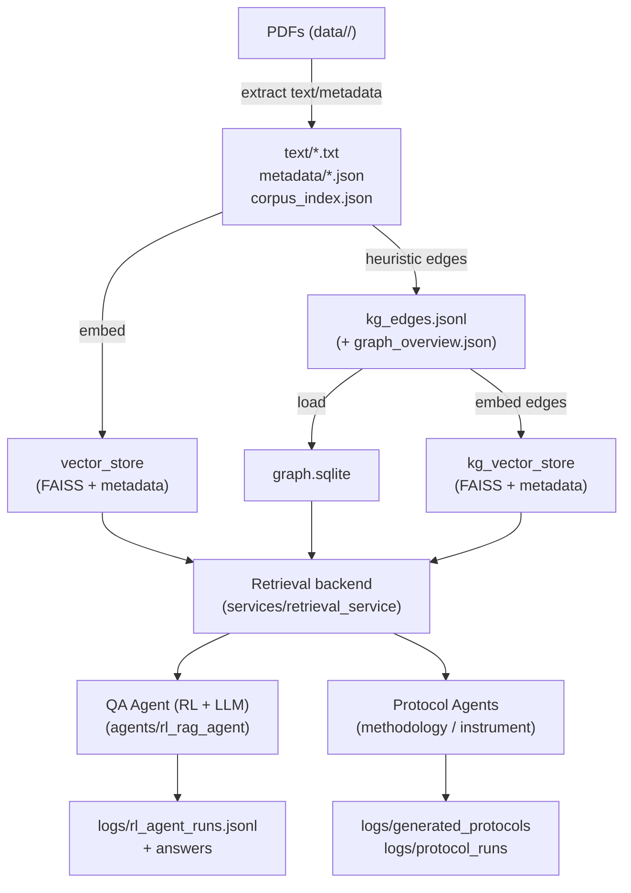
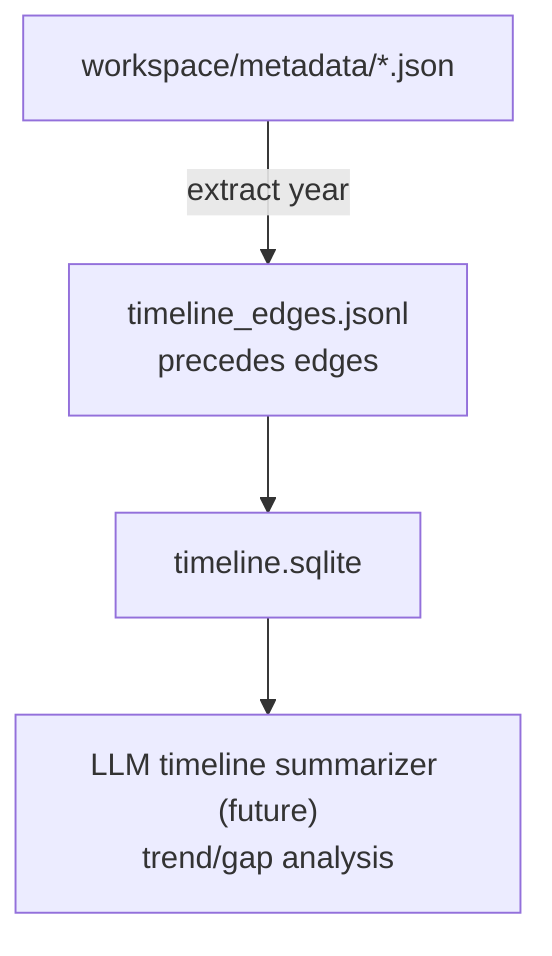

# BioAgentHub: RAG + RL + Protocols across Topics

This workspace ingests scientific PDFs, builds text/vector workspaces (per-topic and combined), and powers retrieval-augmented RL + LLM agents for QA and protocol generation. PETase is just one topic; other topics include `3hp_pand`, `c4c2_decarb`, `ired`, `retron`, `transaminase`, plus the combined `all_topics` workspace for “meta” runs. Biofoundry instrument-aware protocols are supported via instrument corpora. All PDFs now live under `data/<topic>/` (PETase is in `data/petase/`).

## Repository Layout

```
data/                  # topic folders (3hp_pand, c4c2_decarb, ired, petase, retron, transaminase) ← PDFs live here
workspaces/            # per-topic + merged generic workspaces (text + vector stores + KG outputs when built)
KnowledgeGraph/        # legacy PETase KG assets (kept for reference)
08_Instrument_Docs/    # instrument manuals (for Biofoundry modes)
InstrumentGraph/       # instrument text/metadata/kg_edges/vector_store/inventory
scripts/               # ingestion, KG builders, topic workspace builders
services/              # retrieval backends, LLM config, instrument/methodology helpers
agents/                # RL policy, protocol agents (papers + Biofoundry), PPO training
app/                   # CLI, Gradio, unified chatbot
docs/                  # architecture notes and refresh guides
```

## End-to-End Pipeline (Plug & Play per Topic)

### One-shot build for any topic (text + vectors + KG)
```bash
# Example: PETase
python scripts/build_topic_full.py --topic petase --pdf-dir data/petase --workspace workspaces/petase

# Example: 3hp_pand (full KG build uses the same heuristics)
python scripts/build_topic_full.py --topic 3hp_pand --pdf-dir data/3hp_pand --workspace workspaces/3hp_pand
```
- Steps inside the script:
  1) `generic_extract_corpus.py` → `workspace/text`, `workspace/metadata`, `workspace/corpus_index.json`
  2) `generic_build_vector_store.py` → `workspace/vector_store` (FAISS + metadata over text)
  3) `build_kg_edges.py --workspace ...` → `workspace/kg_edges.jsonl`, `workspace/graph_overview.json`
  4) `build_graph_store.py --edges ... --database workspace/graph.sqlite`
  5) `build_vector_store.py --edges ... --out-dir workspace/kg_vector_store` (semantic search over edges)
- Use `--skip-kg` if you only want text + vectors. The KG heuristics are enzyme/condition-centric; refine patterns per topic as needed.

### Batch rebuild (text + vectors only)
```bash
python scripts/build_topic_workspaces.py --data-root data --workspace-root workspaces --model sentence-transformers/all-MiniLM-L6-v2
```
Outputs per-topic workspaces (`workspaces/3hp_pand`, `.../retron`, etc.) and `workspaces/all_topics` (merged). Run `scripts/build_topic_full.py` per topic to add KG/graph on top.

### PETase methodology/protocol extras (optional)
1) `scripts/extract_methodology_full.py`
2) `scripts/build_methodology_kg.py`
3) `scripts/build_methodology_edge_store.py` / `scripts/build_methodology_vector_store.py`
4) `scripts/build_protocols.py`

### Biofoundry instruments
1) Ingest manuals: `scripts/extract_instrument_corpus.py --docs-dir 08_Instrument_Docs --out-dir InstrumentGraph`
2) Instrument KG + vector: `scripts/build_instrument_kg.py`, `scripts/build_instrument_vector_store.py`
3) Inventory: `scripts/build_instrument_inventory.py`

### Architecture (conceptual)
```
PDFs (data/<topic>/)
   │
   ├─ extract text/metadata (generic_extract_corpus.py)
   │     └─ corpus_index.json + text/*.txt + metadata/*.json
   │
   ├─ text vectors (generic_build_vector_store.py) → workspace/vector_store
   │
   ├─ heuristic KG edges (build_kg_edges.py) → kg_edges.jsonl + graph_overview.json
   │     └─ graph DB (build_graph_store.py) → graph.sqlite
   │     └─ edge vectors (build_vector_store.py) → kg_vector_store
   │
   └─ Agents:
         ├─ Retrieval backend (services/retrieval_service) uses vector_store + graph.sqlite
         ├─ QA agent (agents/rl_rag_agent) with RL (heuristic/PPO) + LLM summarizer
         └─ Protocol agents (methodology/instrument) → logs/generated_protocols, logs/protocol_runs
```

### Example workflows
- PETase (full build + QA):
  ```bash
  python scripts/build_topic_full.py --topic petase --pdf-dir data/petase --workspace workspaces/petase
  WORKSPACE_ROOT=workspaces/petase USE_ALIAS_EXPANSION=1 python app/unified_chat.py --mode qa --use-llm --workspace workspaces/petase
  ```
- 3hp_pand (full build, KG optional):
  ```bash
  python scripts/build_topic_full.py --topic 3hp_pand --pdf-dir data/3hp_pand --workspace workspaces/3hp_pand
  WORKSPACE_ROOT=workspaces/3hp_pand USE_ALIAS_EXPANSION=0 python app/unified_chat.py --mode qa --use-llm --workspace workspaces/3hp_pand
  ```

### Diagrams (Mermaid)

Architecture:


Timeline builder:


Timeline summarizer (CLI):
```bash
python agents/timeline_summarizer.py --workspace workspaces/petase
```

RL action masking / vector-only mode:
- Set `VECTOR_ONLY_RAG=1` to force the QA agent to skip graph expansions when a workspace lacks a KG or you want pure vector RAG.

### Regenerating artifacts (not tracked in git)
- Rebuild a topic (text + vectors + KG + timeline):
  ```bash
  python scripts/build_topic_full.py --topic <name> --pdf-dir data/<name> --workspace workspaces/<name>
  python scripts/build_timeline_graph.py --workspace workspaces/<name>
  ```
- Bulk text+vector rebuild (no KG):
  ```bash
  python scripts/build_topic_workspaces.py --data-root data --workspace-root workspaces --model sentence-transformers/all-MiniLM-L6-v2
  ```
- Instrument corpus:
  ```bash
  python scripts/extract_instrument_corpus.py --docs-dir 08_Instrument_Docs --out-dir InstrumentGraph
  python scripts/build_instrument_kg.py
  python scripts/build_instrument_vector_store.py
  python scripts/build_instrument_inventory.py
  ```
Generated artifacts (`data/*.pdf`, `workspaces/`, `InstrumentGraph/`, `KnowledgeGraph/`, `logs/`, `*.faiss`, `*.npy`) are gitignored; rerun the commands above to recreate locally.

## Usage Guide

### Unified chatbot (QA + protocols across workspaces)
```bash
python app/unified_chat.py --mode qa --use-llm --workspace workspaces/all_topics
python app/unified_chat.py --mode protocol --protocol-mode relaxed --workspace workspaces/all_topics
python app/unified_chat.py --mode protocol --protocol-mode biofoundry --workspace workspaces/all_topics
```
- Provide `--workspace` to skip the prompt; defaults are under `workspaces/`. `workspaces/all_topics` is the “meta” combined workspace; per-topic folders run the same retrieval/LLM stack with their own FAISS index. Sets `WORKSPACE_ROOT` and clears retrieval caches. Use `--alias-expansion` only for PETase topics.

### Gradio dashboard
```bash
GRADIO_SERVER_NAME=127.0.0.1 GRADIO_SERVER_PORT=7860 WORKSPACE_ROOT=/path/to/workspaces/all_topics \
  python app/gradio_dashboard.py
```
- Tabs: QA (RAG+RL+LLM), Protocol Designer (methodology vs instrument-constrained), Benchmark Metrics.
- Protocol outputs are also saved to `logs/protocol_runs/gradio_protocol_<timestamp>.md` for persistence.

### PETase CLI chat (legacy)
```bash
python app/cli_chat.py --mode llm
python app/cli_chat.py --mode llm --policy models/ppo_policy.zip
```

### Protocol agents (direct)
- Methodology-driven: `python app/protocol_agent_cli.py "..."` (PETase KnowledgeGraph)
- Instrument-constrained: `python app/instrument_protocol_cli_v2.py "..."` (InstrumentGraph)

### Batch benchmarking
```bash
python scripts/report_answer_metrics.py --mode llm --questions-file benchmark_questions.txt [--policy models/ppo_policy.zip]
```

### FastAPI retrieval (optional)
```bash
uvicorn services.retrieval_service:app --host 0.0.0.0 --port 8000 --reload
```
- Honors `WORKSPACE_ROOT` for swapping vector/graph; `USE_ALIAS_EXPANSION=0` to disable PETase-specific query boosts.
- Uses the FAISS vector index (MiniLM) and optional PETase KG neighbors when present.

## Metrics Explained

| Metric           | Meaning                                                                              | Typical Range |
|------------------|--------------------------------------------------------------------------------------|---------------|
| FAISS avg        | Mean cosine similarity between question embedding and retrieved evidence sentences. | 0.6–0.8       |
| KG conf avg      | Average heuristic confidence of the KG edges used (captures clarity of statements). | 0.4–0.9 (populates as edges refresh) |
| RL reward sum    | Policy reward for the episode (vector hit + graph hop + summary).                   | ~0.6 with heuristic policy |
| Citations        | Inline `[n]` markers referencing the originating PDF.                               | integer IDs   |

## Inputs & Outputs

- **Input**: PDFs under `data/<topic>/` (all topics, including PETase). Add new files and run `scripts/build_topic_full.py` (or `generic_run_pipeline.py` if you want text+vectors only).
- **Output (per workspace)**:
  - Text files (`workspace/text/*.txt`)
  - Metadata JSON (`workspace/metadata/*.json`)
  - Corpus index (`workspace/corpus_index.json`)
  - Vector store over text (`workspace/vector_store/*`)
  - Knowledge graph edges (`workspace/kg_edges.jsonl`) + summary (`workspace/graph_overview.json`)
  - Graph DB (`workspace/graph.sqlite`)
  - Edge vector store (`workspace/kg_vector_store/*`)
- **Logs**: QA/agent runs (`logs/*.jsonl`), protocol drafts (`logs/generated_protocols/*.md`), protocol runs (`logs/protocol_runs/*.md`, `logs/protocol_v2_runs/*.json`).

## How the RL/LLM agent works

There are two policy options:

1. **Heuristic policy** – deterministic sequence (vector search → graph expand → summarize). No training required.
2. **PPO policy** – train with `python agents/train_ppo.py --questions-file benchmark_questions.txt --timesteps 20000 --output models/ppo_policy`. Load via `--policy models/ppo_policy.zip` in the CLI or benchmarking script.

Regardless of policy, the loop is identical:

1. **Vector search**: question embedding ↔ FAISS index to pull top sentences.
2. **Graph expansion**: uses SQLite KG to pull related edges (mutations, substrates) with alias-aware seeding.
3. **Expected entity boost**: ensures question-specific enzymes appear.
4. **Summarization**: GPT-OSS (when `--mode llm`) produces natural prose with inline citations.
5. **Metrics logging**: FAISS/KG scores and RL reward are stored in `logs/rl_agent_runs.jsonl`.

## Current Setup Snapshot

- **Workspaces**: per-topic under `workspaces/<topic>` plus `workspaces/all_topics` (meta). Use `scripts/build_topic_full.py` per topic to add KG/graph alongside text vectors; `scripts/build_topic_workspaces.py` still does bulk text+vector builds.
- **Retrieval embedder**: FAISS indexes built with `sentence-transformers/all-MiniLM-L6-v2`. You can change via `--model` in the build scripts.
- **KG coverage**: PETase legacy KG under `KnowledgeGraph/`; new per-topic KGs go into each `workspaces/<topic>` when built. Heuristics are enzyme/condition centric—tune patterns in `scripts/build_kg_edges.py` for non-PETase topics if needed.
- **LLM**: OpenAI `gpt-5.1` by default (`config/llm_config.json`, reads `OPENAI_API_KEY`). Ollama profile remains in `config/llm_profiles.json`.
- **Protocol generation**: Methodology-driven and instrument-constrained agents pull from the same workspaces/instrument corpora; templated outputs live under `logs/generated_protocols/` (pruned to latest few per topic).
- **Gradio**: set `WORKSPACE_ROOT` + `GRADIO_SERVER_NAME/PORT` to launch; QA tab uses RAG+RL+LLM, Protocol tab uses protocol agents (not the QA RL loop).

## FAQ / Tips

- **New PDFs**: `python scripts/build_topic_full.py --topic <name> --pdf-dir data/<name> --workspace workspaces/<name>` to rebuild text, vectors, and KG. Use `--skip-kg` for text+vectors only.
- **Confidence**: treat FAISS avg + RL reward as quick sanity checks. If FAISS < 0.5, the answer likely needs better evidence. KG confidence populates once edges are refreshed.
- **Benchmarking**: update `benchmark_questions.txt` to track coverage over your priority question set.
- **LLM config**: `config/llm_config.json` uses OpenAI by default; `config/llm_profiles.json` includes Ollama for local inference. Keep secrets in `.env` (see `.env.example`).
- **Workspace portability**: metadata and vector stores reference PDFs via relative paths under `data/<topic>/`.
- **Protocol planning**: run `python scripts/build_protocols.py` followed by `python app/protocol_agent_cli.py "..."` for LangChain/LangGraph-generated experimental roadmaps.

## Roadmap

- Populate KG confidence for historical edges (so `kg_conf_avg` stops showing `n/a`).
- Optional Streamlit/Gradio UI (CLI already supports citations + metrics).
- Hybrid metrics dashboard (plots over time using `scripts/report_answer_metrics.py`).
- Larger question sets + reward shaping for PPO policies.

For any new automation, drop additional scripts into `scripts/` and wire them into `update_pipeline.py`.
