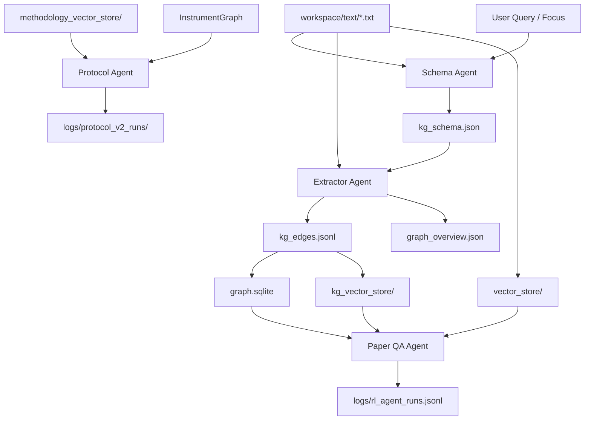

**Agentic KG Architecture (Topic-Agnostic)**

Goal: build a reusable knowledge base for any topic by using lightweight agents that communicate through shared artifacts (JSON, SQLite, FAISS), not tight coupling.

**Agents and Their Outputs**
- **Schema Agent** (`agents/kg_schema_agent.py`): reads a sample of topic text + focus query and emits `workspaces/<topic>/kg_schema.json` (entities, aliases, substrates, metrics, relation keywords).
- **Extractor Agent** (`scripts/build_kg_edges.py`): uses the schema to extract edges from `workspaces/<topic>/text/*.txt` into `workspaces/<topic>/kg_edges.jsonl` and `workspaces/<topic>/graph_overview.json`.
- **Graph Builder** (`scripts/build_graph_store.py`): converts KG edges to `workspaces/<topic>/graph.sqlite` for fast neighbor queries.
- **Edge Vectorizer** (`scripts/build_vector_store.py`): embeds KG edges into `workspaces/<topic>/kg_vector_store/` for semantic graph search.
- **Paper QA Agent** (`agents/rag_agent.py`): consumes text vectors + KG graph for answer synthesis and logs trajectories.
- **Protocol Agent** (`agents/protocol_agent_v2.py`): pulls methodology evidence (per-topic) + instrument evidence to draft protocols.

**Communication Pattern (Artifact-Driven)**
- Agents do not call each other directly. They read/write shared artifacts so the pipeline is reproducible and restartable.
- The schema agent writes `kg_schema.json`; the extractor reads it. The QA agent reads the graph and vector stores. The protocol agent reads methodology and instrument stores.

**Mermaid View**

**How Agents Coordinate**
- **Schema Agent** sets the extraction vocabulary per topic, influenced by the user focus (e.g., protein engineering).
- **Extractor Agent** turns sentences into edges and confidence scores using schema labels; no PETase-specific assumptions.
- **QA Agent** uses both vector RAG and KG expansion to ground answers; KG improves coverage when entities are known.
- **Protocol Agent** blends methodology evidence with instruments; it is independent of the QA agent but uses the same workspace root, so protocol outputs align with topic evidence.
