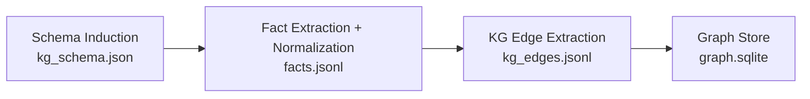

# IE + KG Current System (Snapshot)

## 1) System purpose and scope
This system builds a topic-scoped information extraction (IE) layer and a lightweight knowledge graph (KG) from scientific PDFs. It turns papers into normalized facts, schema-guided KG edges, searchable vectors, and audit reports so the corpus can be queried, summarized, and inspected reliably.

Topics covered in this repo snapshot:
- petase
- 3hp_pand
- retron

## 2) Inputs
Primary inputs are topic folders under `data/<topic>/` containing PDFs. Each topic has a workspace under `workspaces/<topic>/` that stores extracted text, schema artifacts, facts, and KG outputs.

PDF assumptions:
- Text-native PDFs are preferred and are read directly.
- If a page has no extractable text, OCR is used when available.
- Table extraction is attempted using `pdfplumber`; if it fails, table-like text blocks are captured heuristically.

## 3) End-to-end pipeline flow (step-by-step)
### Step 1: PDF ingestion
**Inputs:** PDFs from `data/<topic>/`.
**Outputs:** `workspaces/<topic>/text/*.txt`, `workspaces/<topic>/metadata/*.json`, `workspaces/<topic>/corpus_index.json`.
**Algorithms:** `pypdf` text extraction, fallback to `pdfminer`, fallback to OCR via `pytesseract` + `pypdfium2` (see `forge/scripts/generic_extract_corpus.py`).
**Determinism:** Deterministic for a given PDF set and OCR availability.

### Step 2: Text extraction for captions/tables
**Inputs:** PDFs (from `corpus_index.json` or explicit PDF dir), per-topic workspace.
**Outputs:** `workspaces/<topic>/artifacts/captions.jsonl`, `workspaces/<topic>/artifacts/tables.jsonl`, `workspaces/<topic>/artifacts/summary.json`.
**Algorithms:** Caption regex detection on per-page text; word-level bbox from `pdfplumber`; table extraction via `pdfplumber.find_tables()`; fallback to numeric-line heuristics for table-like blocks (see `forge/scripts/extract_pdf_artifacts.py`). OCR runs only if the page text is empty and OCR is available.
**Determinism:** Deterministic for a given PDF set, text extractor, and OCR availability.

### Step 3: Representative sampling
**Inputs:** `workspaces/<topic>/text/*.txt` and `workspaces/<topic>/corpus_index.json`.
**Outputs:** A deterministic text sample passed to schema induction.
**Algorithms:** Deterministic selection of top documents by `char_count`, then bounded sampling by `max_docs`, `max_chars`, and `seed` (see `forge/agents/kg_schema_agent.py`).
**Determinism:** Deterministic given seed and corpus index.

### Step 4: Schema induction
**Inputs:** Sampled text + focus query.
**Outputs:** `workspaces/<topic>/kg_schema.json` with `schema_version` metadata.
**Algorithms:** LLM-based schema induction with PydanticAI (default). The LLM is asked to produce entities, aliases, substrates, products, metrics, assays, conditions, relation keywords, and unit rules. Outputs are validated against a Pydantic model; invalid outputs raise errors. Backend selection is controlled by `config/llm_config.json` (see `forge/agents/kg_schema_agent.py`).
**Determinism:** Sampling is deterministic; LLM output is not strictly deterministic but is schema-validated and versioned.

### Step 5: Fact extraction
**Inputs:** `workspaces/<topic>/text/*.txt`, captions/tables artifacts, and schema.
**Outputs:** `workspaces/<topic>/facts/facts.jsonl`, `workspaces/<topic>/facts/facts_summary.json`.
**Algorithms:** Regex and schema-guided extraction from text, captions, and tables; table header mapping to typed relations; provenance attached at the fact level (see `forge/scripts/build_structured_facts.py`).
**Determinism:** Deterministic rules and thresholds.

### Step 6: Entity and unit normalization
**Inputs:** Raw fact fields and schema alias lists.
**Outputs:** Normalized entities and units in each fact (fields `head.norm`, `tail.norm`, `normalized_value`, `normalized_unit`).
**Algorithms:** Alias lookup from `entity_aliases` and `key_entities`, with fallback alias inference from corpus; numeric normalization for temperature, pH, percent, time, concentration, kcat/Km/Kcat/Km (see `forge/scripts/build_structured_facts.py` and `forge/utils/kg_schema_utils.py`).
**Determinism:** Deterministic rules.

### Step 7: KG construction
**Inputs:** Text corpus and schema.
**Outputs:** `workspaces/<topic>/kg_edges.jsonl`, `workspaces/<topic>/graph_overview.json`, `workspaces/<topic>/graph.sqlite`.
**Algorithms:** Heuristic sentence-level edge extraction using schema keywords; confidence scoring uses sentence length and keyword matches; graph store is a SQLite node/edge table with type inference (see `forge/scripts/build_kg_edges.py` and `forge/scripts/build_graph_store.py`).
**Determinism:** Deterministic rules.

### Step 8: Audit and validation
**Inputs:** Facts and artifacts per topic.
**Outputs:** `reports/structured_audit/<topic>_report.json`, `reports/structured_audit/<topic>_report.md`, plus combined reports.
**Algorithms:** Counts by relation, confidence bins, top entities, duplicate detection (exact and near-duplicate via `SequenceMatcher`), structured coverage, and balanced samples (see `forge/scripts/run_structured_audit.py`).
**Determinism:** Deterministic given inputs.

## 4) Agents vs deterministic components
### LLM-based agent(s)
**Schema induction agent:** `forge/agents/kg_schema_agent.py`
- **Task:** Induce topic-specific schema (entities, aliases, substrates, metrics, assays, relation keywords, unit rules).
- **Library:** PydanticAI (`pydantic_ai` + `pydantic_ai.models.openai.OpenAIModel`).
- **Model assumptions:** Uses the OpenAI-compatible API specified in `config/llm_config.json` (default model `gpt-4o-mini`, API key from `OPENAI_API_KEY` unless configured otherwise).
- **Validation:** Strict Pydantic model validation; invalid outputs raise errors; schema is normalized and versioned.

### Deterministic pipeline components
All other IE/KG steps are deterministic or heuristic rules: PDF text extraction, caption/table extraction, fact extraction and normalization, KG edge extraction, graph store creation, and audit reporting.

## 5) Algorithms and methods
**Extraction strategies:**
- Regex-based mention detection for enzymes, proteins, mutations, units, and metrics.
- Caption detection via regex on page text; table detection via `pdfplumber` with a fallback for numeric block detection.
- Schema-guided keyword matching for substrates, metrics, assays, hosts, and relation keywords.

**Normalization strategies:**
- Entity canonicalization via schema alias lookup; fallback corpus-derived alias inference.
- Unit normalization to canonical forms: temperature to Celsius, time to minutes, concentration to molar, pH and percent parsing, kinetic metrics parsing.

**Provenance tracking:**
- Facts carry `provenance` with PDF path, page, bbox, caption or table ID, row/column (for tables), and topic.
- KG edges carry `paper` and `sentence` fields; graph overview tracks top sources.

**Confidence scoring:**
- KG edges use a heuristic scoring function based on sentence length and relation keyword presence, with small boosts for focus keywords.
- Structured facts use fixed base confidences by source type: text, captions, tables, or table-text fallbacks.

## 6) Data structures and storage
**Schema artifacts:** `workspaces/<topic>/kg_schema.json`
- Fields: topic, focus_query, key_entities, entity_aliases, substrates, products, metrics, conditions, hosts, assays, relation_keywords, unit_rules, schema_version.

**Facts representation:** `workspaces/<topic>/facts/facts.jsonl`
- Each fact includes `head` and `tail` (raw + normalized), `relation_type`, `raw_value`, `normalized_value`, `normalized_unit`, `evidence_text`, `provenance`, `confidence`.

**KG representation:** `workspaces/<topic>/kg_edges.jsonl` and `workspaces/<topic>/graph.sqlite`
- JSONL edges include source, relation, target, paper, sentence, confidence.
- SQLite graph has `nodes` and `edges` tables for fast relational queries; node types are inferred heuristically.

**Audit artifacts:** `reports/structured_audit/*_report.json` and `*_report.md`
- Topic-level and combined reports with counts, confidence distributions, duplicates, and samples.

**Vector stores:**
- `workspaces/<topic>/vector_store/` from full-text chunks (sentence-transformer embeddings).
- `workspaces/<topic>/kg_vector_store/` from KG edges (semantic search over edge statements).

These formats prioritize portability (JSONL), transparency (explicit provenance), and lightweight queryability (SQLite) suitable for iterative research and review.

## 7) Flow visualizations (Mermaid)
```mermaid
flowchart TD
  A[PDFs in data/<topic>] --> B[Text Extraction
pypdf -> pdfminer -> OCR]
  B --> C[Workspace Text + Metadata
text/*.txt, metadata/*.json, corpus_index.json]
  C --> D[Caption/Table Extraction
captions.jsonl, tables.jsonl]
  C --> E[Schema Induction (PydanticAI)
kg_schema.json]
  D --> F[Structured Fact Extraction
facts.jsonl]
  E --> F
  C --> G[KG Edge Extraction
kg_edges.jsonl]
  G --> H[SQLite Graph Store
graph.sqlite]
  D --> I[Structured Audit
reports/structured_audit]
  F --> I
```



## 8) Guarantees and limitations
**Guarantees:**
- Deterministic extraction and normalization for a given input corpus and configuration.
- Strict schema validation for the PydanticAI schema induction path.
- Provenance is preserved for all facts and artifacts.
- Audit reports provide reproducible summaries and samples for manual review.

**Limitations:**
- LLM-based schema induction is not fully deterministic and can vary across runs, even with fixed sampling.
- Table extraction depends on PDF structure; scanned tables may degrade to text blocks without structure.
- OCR quality varies by PDF scan quality and can introduce noise.
- KG edges are heuristically extracted and may miss nuanced relations without explicit keyword cues.
- Entity canonicalization is limited to schema aliases and simple normalization rules; cross-topic ontology harmonization is not enforced.
